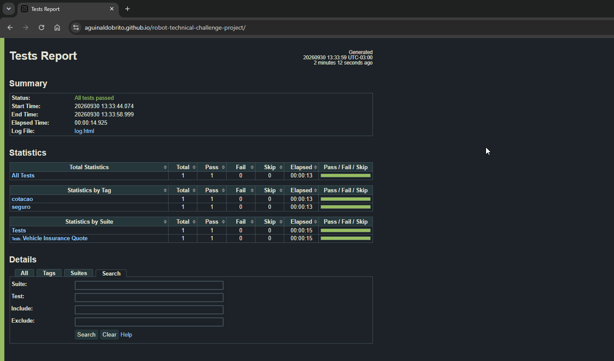

# Desafio Técnico - Robot Framework (com Browser Library)

Automação E2E do fluxo de cotação de seguro de veículo do
[Tricentis Sample App](http://sampleapp.tricentis.com/101/app.php), usando
**Robot Framework**, **Browser Library** (baseada em Playwright) e o padrão
**Page Objects**, com pipeline de **CI/CD no GitHub Actions**.

📊 **Relatório da última execução:** https://aguinaldobrito.github.io/robot-technical-challenge-project/

## Evidência



## Tecnologias

- Robot Framework + Browser Library (Playwright)
- Python 3.12
- Padrão Page Object com arquivos `.resource`
- - Cenário descrito em estilo Gherkin (BDD)
- GitHub Actions (execução headless, relatórios como artefatos e publicação no GitHub Pages)

## Estrutura do projeto

```
robot-technical-challenge-project/
├── .github/workflows/
│   └── robot-tests.yml                     # pipeline CI/CD
├── docs/
│   └── report.png                          # printscreen do relatório (usado no README)
├── features/
│   └── vehicle_insurance_quote.feature     # cenário em Gherkin (documentação)
├── pages/                                  # Page Objects, um por aba do formulário
│   ├── insurant_page.resource
│   ├── price_page.resource
│   ├── product_page.resource
│   ├── quote_page.resource
│   └── vehicle_page.resource
├── resources/
│   ├── variables.resource                  # todas as variáveis da automação
├── tests/
│       ├── results/                        # relatórios gerados após a execução (log.html, report.html, output.xml)
│       ├── vehicle_insurance_quote.robot   # ponto de entrada da execução (feature em estilo Gherkin)
├── .gitignore                              # arquivos e pastas ignorados pelo Git (ex: results/, venv/)
├── README.md                               # documentação do projeto
└── requirements.txt                        # dependências Python do projeto
```
*os restantes são arquivos temporários gerados pelo próprio robot*

Cada aba do wizard (Vehicle Data, Insurant Data, Product Data, Price Option,
Send Quote) virou um `.resource` próprio, com suas variáveis de localizadores
e suas keywords - isso é o padrão Page Object aplicado ao Robot Framework.

## Pré-requisitos

- Python 3.9+
- Robot Framework
- Node.js 16+ (necessário para o Playwright, usado internamente pela Browser Library)
- VS Code com a extensão **Robot Framework Language Server** (recomendado)

## Instalação

```bash
python -m venv .venv
source .venv/bin/activate        # Windows: .venv\Scripts\activate
pip install -r requirements.txt
rfbrowser init                    # instala os navegadores do Playwright
rfbrowser init chromium           # instala o navegador chromium para melhor performance
```

## Execução

Headless (padrão):

```bash
robot -d results tests/
```

Com navegador visível e câmera mais lenta, para acompanhar o teste:

```bash
robot -v HEADLESS:False -v SLOWMO:0.5s -d results tests/
```

Os relatórios (`log.html`, `report.html`, `output.xml`) são gerados em `results/`.

## CI/CD

O workflow `.github/workflows/robot-tests.yml` roda a cada push e pull request
na `main` (e também manualmente). Ele instala as dependências, executa os testes
em modo headless, publica os relatórios como artefatos e faz o deploy do
relatório no GitHub Pages.

## Fluxo automatizado

1. Abre `http://sampleapp.tricentis.com/101/app.php`
2. Preenche a aba **Enter Vehicle Data** e avança
3. Preenche a aba **Enter Insurant Data** e avança
4. Preenche a aba **Enter Product Data** e avança
5. Preenche a aba **Select Price Option** e avança
6. Preenche a aba **Send Quote** e clica em **Send**
7. Verifica a mensagem **"Sending e-mail success!"** na tela

## Publicação no Git

```bash
git init
git add .
git commit -m "Desafio técnico: automação de cotação de seguro com Robot Framework"
git branch -M main
git remote add origin <URL_DO_SEU_REPOSITORIO>
git push -u origin main
```
